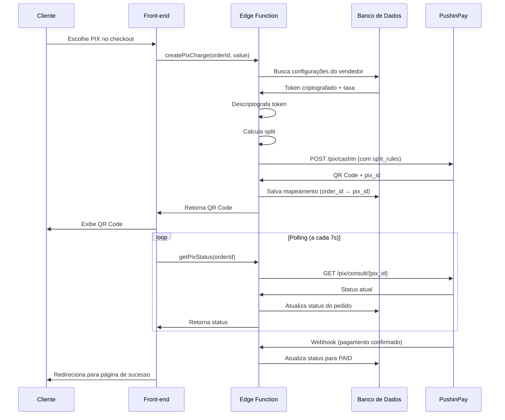

# RiseCheckout - Integração PushinPay PIX

## 🎯 Visão Geral

Este projeto implementa uma integração completa com a **PushinPay** para pagamentos via PIX, incluindo:

- ✅ **Split de Pagamento Automático**: Divisão da receita entre vendedor e plataforma
- ✅ **Criptografia de Tokens**: Segurança AES-256-GCM para credenciais sensíveis
- ✅ **Webhook em Tempo Real**: Atualização automática de status de pagamento
- ✅ **Polling Inteligente**: Verificação periódica como fallback
- ✅ **UI/UX Completa**: Interface amigável para configuração e checkout
- ✅ **Sandbox e Produção**: Suporte a ambientes de teste e produção

## 🏗️ Arquitetura

```
┌─────────────────┐
│  Front-end      │
│  (React + TS)   │
└────────┬────────┘
         │
         ├─── Página Financeiro (configuração)
         ├─── Componente PixPayment (checkout)
         └─── Serviço pushinpay.ts
                │
                ▼
┌─────────────────────────────────────┐
│  Edge Functions (Supabase)          │
├─────────────────────────────────────┤
│  • encrypt-token                    │
│  • pushinpay-create-pix             │
│  • pushinpay-get-status             │
│  • pushinpay-webhook                │
└────────┬────────────────────────────┘
         │
         ├─── Helpers compartilhados (_shared/)
         │    • crypto.ts (criptografia)
         │    • db.ts (operações de banco)
         │
         ▼
┌─────────────────────────────────────┐
│  Banco de Dados (PostgreSQL)        │
├─────────────────────────────────────┤
│  • payment_gateway_settings         │
│  • payments_map                     │
│  • orders                           │
└─────────────────────────────────────┘
         │
         ▼
┌─────────────────────────────────────┐
│  PushinPay API                      │
│  (api.pushinpay.com.br)             │
└─────────────────────────────────────┘
```

## 📁 Estrutura de Arquivos

```
risecheckout/
├── src/
│   ├── components/
│   │   └── checkout/
│   │       └── PixPayment.tsx          # Componente de pagamento PIX
│   ├── pages/
│   │   └── Financeiro.tsx              # Página de configuração
│   └── services/
│       └── pushinpay.ts                # Serviço de integração
│
├── supabase/
│   ├── functions/
│   │   ├── _shared/
│   │   │   ├── crypto.ts               # Módulo de criptografia
│   │   │   └── db.ts                   # Helpers de banco de dados
│   │   ├── encrypt-token/
│   │   │   └── index.ts                # Criptografa tokens
│   │   ├── pushinpay-create-pix/
│   │   │   └── index.ts                # Cria cobrança PIX
│   │   ├── pushinpay-get-status/
│   │   │   └── index.ts                # Consulta status
│   │   └── pushinpay-webhook/
│   │       └── index.ts                # Recebe webhooks
│   ├── migrations/
│   │   └── 20251101_add_payment_gateway_tables.sql
│   └── .env.example                    # Variáveis de ambiente
│
├── PUSHINPAY_SETUP.md                  # Guia de configuração
└── README_PUSHINPAY.md                 # Este arquivo
```

## 🚀 Início Rápido

### 1. Configuração Inicial

```bash
# Clone o repositório
git clone <repo-url>
cd risecheckout

# Instale dependências
npm install

# Configure variáveis de ambiente
cp supabase/.env.example supabase/.env
# Edite supabase/.env com suas credenciais
```

### 2. Deploy das Edge Functions

```bash
# Login no Supabase
supabase login

# Link ao projeto
supabase link --project-ref <seu-project-ref>

# Deploy
supabase functions deploy encrypt-token
supabase functions deploy pushinpay-create-pix
supabase functions deploy pushinpay-get-status
supabase functions deploy pushinpay-webhook
```

### 3. Configuração do Vendedor

1. Acesse a página **Financeiro**
2. Insira o **API Token** da PushinPay
3. Selecione o **Ambiente** (Sandbox/Produção)
4. Defina a **Taxa da Plataforma** (0-50%)
5. Salve as configurações

### 4. Teste

Crie um pedido de teste e escolha PIX como forma de pagamento. O QR Code será gerado automaticamente.

## 🔐 Segurança

### Criptografia de Tokens

Os tokens da PushinPay são criptografados usando **AES-256-GCM** antes de serem armazenados no banco de dados:

```typescript
// Fluxo de criptografia
Token em texto claro → Edge Function (encrypt-token) → AES-256-GCM → Token criptografado → Banco de dados
```

### Row-Level Security (RLS)

Todas as tabelas possuem políticas RLS ativas:

- **payment_gateway_settings**: Cada usuário só acessa suas próprias configurações
- **payments_map**: Acesso restrito a Edge Functions (service_role)

### Mascaramento no Cliente

Os tokens nunca são expostos ao cliente. A página Financeiro exibe `••••••••` ao invés do token real.

## 💰 Split de Pagamento

O split é calculado automaticamente com base na taxa configurada pelo **administrador da plataforma** nas variáveis de ambiente:

```typescript
// Exemplo: Pedido de R$ 100,00 com taxa de 10%
Valor total: R$ 100,00
Split plataforma: R$ 10,00 (10%)
Vendedor recebe: R$ 90,00 (90%)
```

### Limitações

- Taxa máxima: **50%**
- Valor mínimo por transação: **R$ 0,50**
- Split é aplicado automaticamente em todas as transações
- Taxa é controlada **apenas pelo administrador** via variável de ambiente `PLATFORM_FEE_PERCENT`
- Vendedores **não podem** alterar a taxa da plataforma

## 📊 Fluxo de Pagamento



## 🧪 Testes

### Ambiente Sandbox

Use o ambiente Sandbox para testes sem custo:

1. Solicite acesso ao Sandbox no suporte da PushinPay
2. Configure o vendedor com token de Sandbox
3. Use o app de testes da PushinPay para simular pagamentos

### Ambiente Produção

Antes de ir para produção:

- [ ] Testes completos em Sandbox
- [ ] Webhook configurado e testado
- [ ] Split validado no painel da PushinPay
- [ ] Fluxo de erro testado
- [ ] Documentação revisada

## 📈 Monitoramento

### Logs das Edge Functions

```bash
# Logs em tempo real
supabase functions logs pushinpay-create-pix --tail
supabase functions logs pushinpay-webhook --tail

# Logs de um período específico
supabase functions logs pushinpay-create-pix --since 1h
```

### Consultas Úteis

```sql
-- Transações das últimas 24h
SELECT * FROM payments_map 
WHERE created_at > NOW() - INTERVAL '24 hours'
ORDER BY created_at DESC;

-- Vendedores ativos
SELECT COUNT(*) as total_vendedores 
FROM payment_gateway_settings;

-- Taxa média da plataforma
SELECT AVG(platform_fee_percent) as taxa_media 
FROM payment_gateway_settings;
```

## 🐛 Troubleshooting

### Problema: QR Code não é gerado

**Causa**: Configuração de gateway não encontrada

**Solução**: Verifique se o vendedor configurou suas credenciais em Financeiro

### Problema: Webhook não atualiza status

**Causa**: URL do webhook incorreta ou não configurada

**Solução**: 
1. Verifique a URL no painel da PushinPay
2. Teste manualmente: `curl -X POST <webhook-url> -d '{"id":"test","status":"paid"}'`

### Problema: Erro ao descriptografar token

**Causa**: ENCRYPTION_KEY não configurada ou incorreta

**Solução**: Verifique as variáveis de ambiente das Edge Functions

## 📚 Documentação Adicional

- [Guia de Configuração Completo](./PUSHINPAY_SETUP.md)
- [Documentação PushinPay](https://docs.pushinpay.com.br)
- [Supabase Edge Functions](https://supabase.com/docs/guides/functions)

## 🤝 Contribuindo

1. Crie uma branch para sua feature: `git checkout -b feature/nova-feature`
2. Commit suas mudanças: `git commit -m 'feat: adicionar nova feature'`
3. Push para a branch: `git push origin feature/nova-feature`
4. Abra um Pull Request

## 📄 Licença

Este projeto está sob a licença MIT. Veja o arquivo LICENSE para mais detalhes.

## 🆘 Suporte

Para suporte técnico:
- **PushinPay**: suporte@pushinpay.com.br
- **Projeto**: Abra uma issue no repositório

---

**Desenvolvido com ❤️ pela equipe RiseCheckout**
